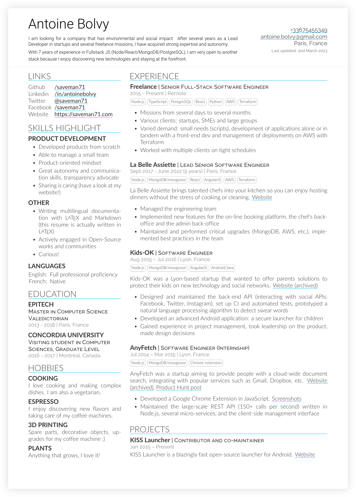

# resume

A **one-page**, **two asymmetric column** resume template in **LuaTeX**, largely inspired from [Deedy-Resume](https://github.com/deedy/Deedy-Resume).

It is licensed under the Apache License 2.0.

## Motivation

This template attempts to **look clean**, highlight **details**, be a **single page**, and allow useful **LaTeX templating** as well as to be **machine readable**.

The goal was also to make a bi-lingual resume (en/fr) with as much code in the common class `resume-openfont.cls`.

## Preview



## Usage

A `Makefile` is there to do all the heavy lifting for you. Just run:

```sh
make
```

## License

```
Copyright 2018 Antoine Bolvy

Licensed under the Apache License, Version 2.0 (the "License");
you may not use this file except in compliance with the License.
You may obtain a copy of the License at

    http://www.apache.org/licenses/LICENSE-2.0

Unless required by applicable law or agreed to in writing, software
distributed under the License is distributed on an "AS IS" BASIS,
WITHOUT WARRANTIES OR CONDITIONS OF ANY KIND, either express or implied.
See the License for the specific language governing permissions and
limitations under the License.
```
